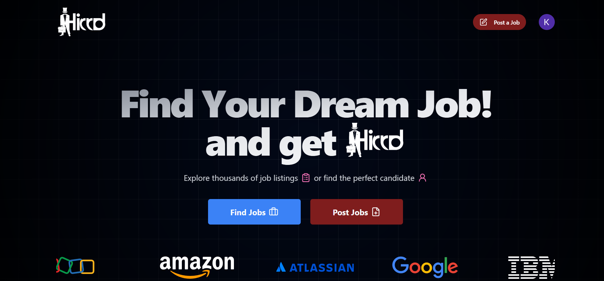
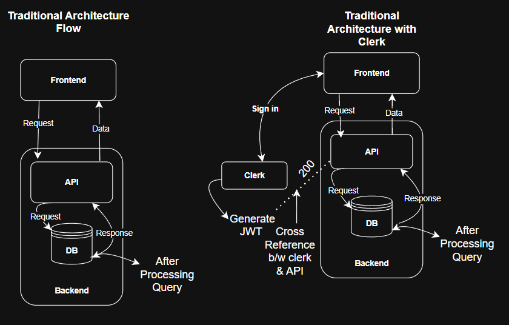
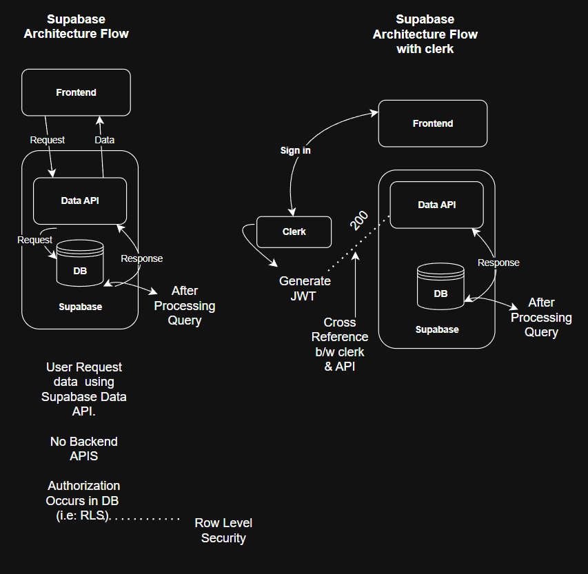

# 💼 Hired — Smart Job Portal for Job Seekers & Recruiters

<p align="center">
  
</p>

<div style="text-align: center; margin-top: 2px;">
  
  
  
  
  
  
  
  
  
</div>

<div align="center">
  <h3>
    Hired is a modern, responsive job board that connects recruiters and job seekers. Built with a scalable architecture and modern UI/UX for real-world usability.
  </h3>
  <p><a href="https://your-deployed-link.com" target="_blank">🚀 <strong>Live Demo</strong></a></p>
</div>

---

## 📋 Table of Contents

1. [Introduction](#-introduction)
2. [Architecture Flow Diagrams](#-architecture-flow-diagrams)
3. [Tech Stack](#-tech-stack)
4. [Features](#-features)
5. [Quick Start](#-quick-start)
6. [Installation](#-installation)
7. [License](#-license)
8. [Acknowledgements](#-acknowledgements)

---

### 🚀 Introduction

**Hired** is a full-stack job board platform enabling seamless job discovery, application management, and recruiter interactions. It includes:

- Secure authentication via Clerk
- Realtime database integration with Supabase
- Tailored user dashboards for job seekers and employers
- Optimized for speed and accessibility using Vite and TailwindCSS

---

### 🏗 Architecture Flow Diagrams

<p align="center">
  
  
</p>

---

### 🔧 Tech Stack

- ⚛ **React 19** — UI library with concurrent rendering
- ⚡ **Vite 7** — Fast, modern build tool
- 🌈 **TailwindCSS 3.3** — Utility-first styling
- 📦 **Shadcn UI** — Accessible component system with Radix primitives
- 🔐 **Clerk** — Full-stack authentication for React
- 🧰 **Supabase** — Realtime database and backend-as-a-service
- 🧪 **Zod & React Hook Form** — Schema-based validation
- 📄 **React Router DOM 7** — Declarative routing
- 🎡 **Embla Carousel** — For scrollable sliders
- 🔍 **Lucide Icons** — Elegant icon set

---

## ⚙ Features

- 🧑‍💼 Role-based dashboards (Recruiter & Job Seeker)
- 💾 Save and apply for jobs with pagination
- 🔐 Secure login/signup with Clerk
- 🧭 Location autocomplete (Country-State-City)
- 💼 Recruiter job management: create, edit, delete
- 📊 Visual feedback via loaders and pagination controls
- 🎨 Responsive, accessible UI with Shadcn + Tailwind

---

## ⚡ Quick Start

### 📦 Prerequisites

- Node.js ≥ 18.x
- npm, pnpm, or yarn
- Supabase project setup
- Clerk project setup

---

## 🛠️ Installation

Clone the repository:

```bash
git clone https://github.com/your-username/hired.git
cd hired
npm install
```

Start the development server:

```bash
npm run dev
```

Build for production:

```bash
npm run build
```

Preview production build locally:

```bash
npm run preview
```

### Environmental Variables (.env)

```bash
VITE_SUPABASE_URL= Your_URL
VITE_SUPABASE_ANON_KEY= Your_Key
VITE_CLERK_PUBLISHABLE_KEY= You_Key
```

### License

This project is licensed under the MIT License.
Feel free to use, modify, and distribute it for personal or commercial projects.

Acknowledgements

- React
- Vite
- Tailwind CSS
- Supabase
- Clerk
- Shadcn UI
- Zod
- React Hook Form
- Embla Carousel
